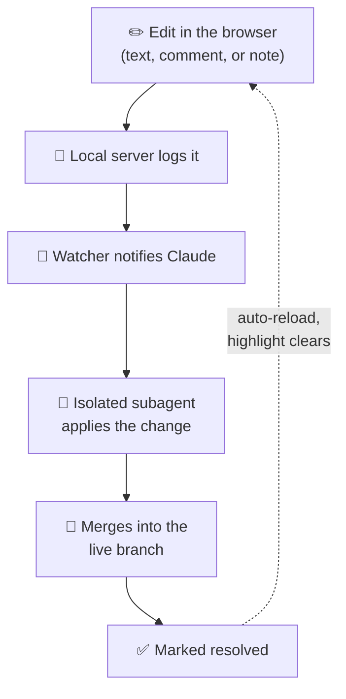
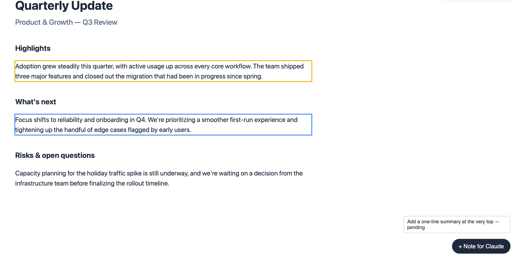
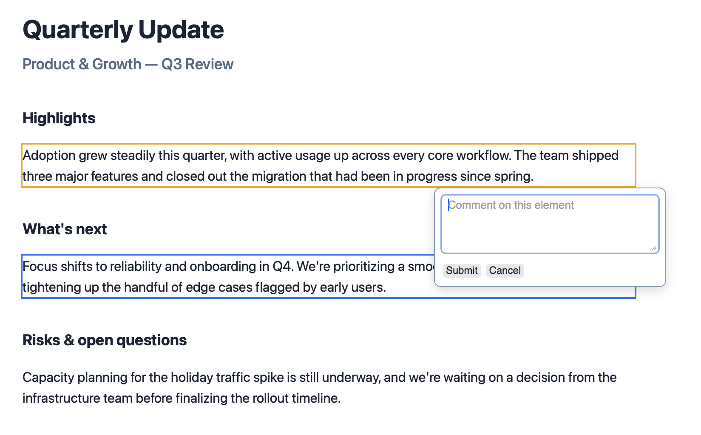
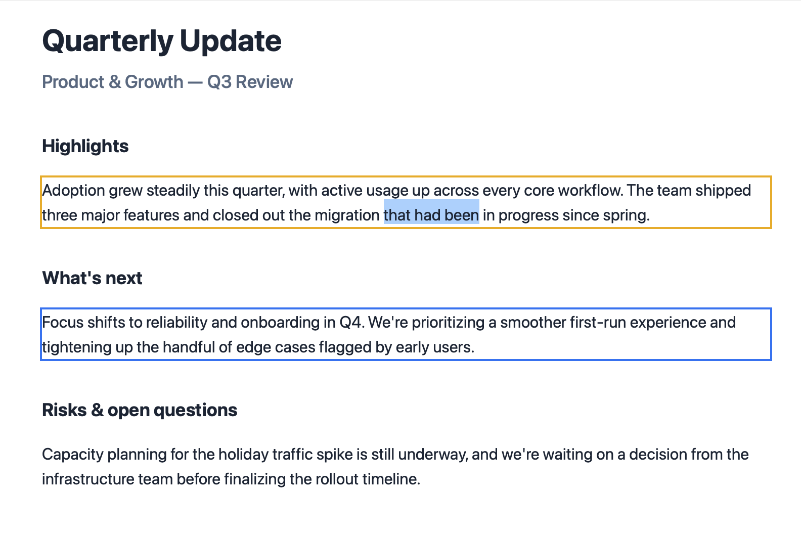

# Live Slide-Edit Tool

A small, standalone tool that lets someone make continuous, in-browser edits and comments on an HTML slide deck, with an already-running Claude Code session picking up each edit as it's made, applying it via an isolated subagent, and merging it into the version being served.

No build step, no manual copy-paste-into-chat loop, no separate live-collaboration backend to run — just a local server, a watcher, and Claude reacting to whatever changes.

## How it works



Every edit — an inline text change, a margin comment, or a freeform note — becomes its own small, isolated unit of work: a fresh subagent applies just that one change in its own git worktree, so concurrent edits never step on each other. Once merged, the page auto-refreshes and picks up right where you left off, including anything still pending.

When you're done editing, it opens a pull request into the deck's normal publish pipeline — nothing goes live until that PR is reviewed and merged.

## What it looks like

Every editable paragraph gets an outline showing its state — yellow while an edit is waiting to be picked up, blue while a subagent is working it, and it clears entirely once resolved. A floating notes panel tracks freeform notes that aren't tied to any specific element:



Hover any paragraph to leave a margin comment on it directly:



Or just click in and edit the text inline, like any editable field:



## Installation

**Option 1 — clone the repo (recommended if you'll want updates):**

```bash
git clone https://github.com/patrickfreyer/live-slide-edit-tool.git ~/projects/live-slide-edit-tool
ln -s ~/projects/live-slide-edit-tool/skill ~/.claude/skills/live-slide-edit
```

The symlink means a later `git pull` in `~/projects/live-slide-edit-tool` picks up updates automatically — no re-copying needed.

**Option 2 — just the packaged skill:** download [`live-slide-edit.skill`](live-slide-edit.skill) (also attached to every [release](../../releases)) and unzip it straight into your skills directory:

```bash
mkdir -p ~/.claude/skills/live-slide-edit
unzip live-slide-edit.skill -d ~/.claude/skills/live-slide-edit
```

Either way, restart Claude Code (or start a new session) afterward so it picks up the new skill.

## Usage

See [`skill/SKILL.md`](skill/SKILL.md) for how an orchestrating Claude Code session starts a live-edit session against any deck directory, reacts to edits, and wraps up with a pull request.

Zero external dependencies — the tool itself is stdlib-only Python, no `pip install` required.
